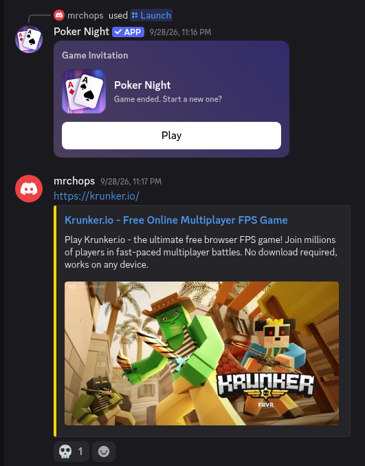
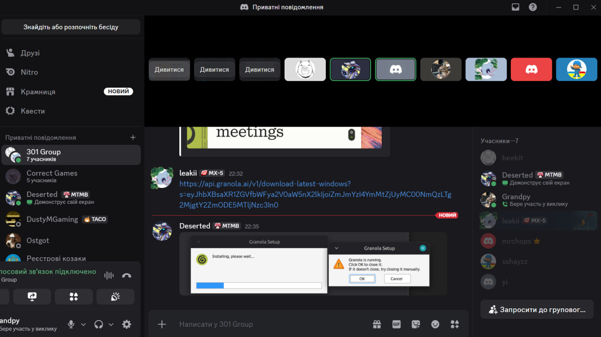

# AMD-Schola/The hard workers

## Product Details
 
#### Q1: What is the product?
We are building a Godot Engine port of AMD Schola, an open-source cross-platform reinforcement learning library currently built for Unreal Engine. We are partnering with AMD to extend their tool to support Godot. Our partners are Alexander Cann (Member of Technical Staff) and TianYue "Micheal" Liu (Senior Software Engineer). This tool will allow developers to natively define Reinforcement Learning (RL) Environments and Agents within Godot, attaching modular sensors and actuators, and connecting them to Python-based RL frameworks like Gymnasium, RLlib, or Stable-Baselines3. For example, a developer can create a racing car in Godot and train it to navigate a track using RL, without having to write the complex engine-to-Python communication logic from scratch.

#### Q2: Who are your target users?
- Game developers building NPCs or AI gameplay systems using Godot.
- AI / RL researchers needing a lightweight, accessible engine (Godot) as a training environment.
- Robotics and sim-to-real practitioners leveraging game engines for prototyping simulation environments before transferring to hardware.

#### Q3: Why would your users choose your product? What are they using today to solve their problem/need?
Currently, developers wanting to use Godot for RL either have to write custom sockets or RPC layers from scratch or rely on unofficial Godot integrations that are separate from Schola's maintained Python ecosystem. Our product brings Schola's environment, training, and inference workflow to Godot. The MVP saves developers from implementing engine-to-Python communication, episode coordination, space serialization, and local policy inference themselves. Reusable specialized sensor and actuator nodes are a stretch goal rather than an MVP promise. This supports AMD's goal of making Schola a maintained multi-engine platform with transferable concepts across engines.

#### Q4: What are the user stories that make up the Minimum Viable Product (MVP)?
These stories describe the minimum end-to-end product agreed upon during the initial AMD partner meeting: a Godot developer can define a simple reinforcement-learning environment, train an agent through Schola's existing Python ecosystem, export the learned policy, and run that policy inside Godot without Python.

Implementation tasks, ownership, dependencies, and progress are tracked on the team's [Trello board](https://trello.com/b/Ry0Qkx2R). This document states the user value and acceptance boundary; Trello breaks each story into engineering tasks.

##### US1: Define a reinforcement-learning environment

**Story:** As a Godot developer, I want to define a reinforcement-learning environment through a small Godot styled interface so that I can make an environment trainable without writing networking code.

**Acceptance criteria:**

- A developer can implement or configure the environment's initialization, reset, observation, reward, and terminal-state behavior.
- The interface is designed to look native to Godot without bringing along unnecessary design decisions that were made specifically for Unreal
- The environment can contain at least one agent.
- Environment code does not directly manage sockets, RPC calls, or serialized protocol messages.
- The environment accepts a reproducible random seed and optional reset configuration.
- Invalid or incomplete environment configuration produces a clear error.

##### US2: Declare observation and action spaces

**Story:** As a Godot developer, I want to define observation and action spaces using reusable types so that Schola can validate and communicate the agent's available inputs and outputs.

**Acceptance criteria:**

- The core supports Box, Discrete, MultiDiscrete, and MultiBinary spaces and their corresponding point values.
- Spaces expose their shape, bounds, and data type where applicable.
- An omitted Box bound represents an unbounded dimension rather than zero.
- An observation or action that does not match its declared space is rejected with a useful error.
- Space definitions can be translated to the representation expected by the existing Schola Python package.
- Round-trip tests serialize and deserialize spaces, points, interaction definitions, and agent states without changing their values.

##### US3: Connect to existing Python training tools

**Story:** As an ML practitioner, I want a Godot environment to connect to Schola's existing Python training tools so that I can train policies without maintaining a separate Godot-specific Python workflow.

**Acceptance criteria:**

- The Godot integration completes the connection and environment-definition exchange with the existing Python client.
- The integration uses Schola's existing protocol and gRPC services unless an alternative is approved by AMD.
- The transport implements `StartGymConnector`, `RequestTrainingDefinition`, and `UpdateState` from the existing Gym connector protocol.
- Python can discover the available environment, agents, observation spaces, and action spaces.
- The transport is isolated behind a core interface so the engine-independent code does not depend directly on gRPC.
- Connection failures and incompatible protocol data produce actionable errors instead of hanging the game or training process.

##### US4: Execute the episode lifecycle

**Story:** As an ML practitioner, I want Schola to coordinate observations, actions, rewards, terminal states, and resets so that training proceeds correctly across complete episodes.

**Acceptance criteria:**

- For each step, Godot supplies an observation and accepts a compatible action from Python.
- Each step returns the resulting observation, reward, and termination or truncation state.
- Reset restores the demonstration environment to a valid initial state and returns an initial observation.
- The connector supports the existing disabled, same-step, and next-step auto-reset modes with the same externally observable behavior as Schola's Python API.
- The connector can coordinate more than one environment in a running scene.
- An integration test completes multiple episodes without lifecycle deadlock or state leakage between episodes.

##### US5: Configure Schola through Godot-native tools

**Story:** As a Godot developer, I want to configure agents and environments through nodes and the Inspector so that I can use familiar Godot workflows instead of editing protocol or networking code.

**Acceptance criteria:**

- A developer can add the required Schola components to a scene using Godot's normal node workflow.
- Essential settings are visible and editable in the Inspector with understandable names and defaults.
- The demonstration project can be configured without modifying Schola's internal source code.
- The demonstration agent receives a small reward for moving backward, a larger reward for moving forward, and a penalty for remaining still.
- A configurable maximum step count truncates an episode that does not otherwise terminate.
- Running the scene reports missing or conflicting configuration clearly.

##### US7: Run and ship an ONNX policy

**Story:** As a Godot developer, I want a trained policy to drive my agent with Python closed and to exclude training-only dependencies from exported games so that I can ship an autonomous agent without unnecessary training infrastructure.

**Acceptance criteria:**

- Godot loads the exported ONNX model and validates that its inputs and outputs match the agent's declared spaces.
- On each physics step, the agent follows an observe-infer-act loop that applies model output as its action.
- The demonstration agent performs the intended learned behavior while Python is not running.
- Missing, invalid, or incompatible model files produce a clear error.
- Training and transport code is packaged separately from the core environment API and inference code.
- A Godot export containing the demonstration environment runs its trained policy without Python or a live gRPC connection.
- The exported build excludes the training add-on without preventing the project from loading or using inference.
- The documentation identifies which modules are required for training and which are required in a shipped game.

##### Partner review

Alexander Cann reviewed and approved these user stories during our second partner meeting. The meeting summary is available in [`deliverables/team/minutes/partner-meeting-02.md`](../team/minutes/partner-meeting-02.md).

##### Interactive mockup

Our team created an interactive Godot prototype, now preserved under [`Godot/archive/d1_demo`](../../Godot/archive/d1_demo). It demonstrates the Godot-native workflow from US5: adding Schola environment and agent nodes, configuring reward and episode settings in the Inspector, moving an agent toward a goal, displaying reward feedback, and resetting after success or failure. A [video walkthrough is available on YouTube](https://youtu.be/zg4K3fiQjJw). AMD did not provide the prototype; Alexander Cann reviewed the demo during our second partner meeting and provided feedback about keeping the environment interface small and composable.

The archived prototype uses C# to demonstrate the interface without a training backend or persistence. It is not the final implementation language; the production add-on uses the C++ GDExtension architecture described below. The C++ foundation does not yet provide the environment and reward APIs needed to port the demo.

#### Q5: Have you decided on how you will build it? Share what you know now or tell us the options you are considering.

Tech Stack:
- *Game engine:* Godot 4.7
- *Engine-side language:* C++ with a native GDExtension
- *RL side:* Python and Gymnasium
- *Communication:* Custom gRPC integration
- *Inference:* ONNX as the model format and ONNX Runtime for inference inside Godot

Schola-Godot is a developer library, not a hosted service, so there is no server to deploy. It will be distributed as a Godot **addon** that developers drop into their project's `addons/` folder, with the Python side installed via `pip` as Schola already is.
Training-only code (gRPC, connectors) will be packaged separately from the core and inference code, so a shipped game includes only what it needs to run a trained model. Longer term, the work is intended to be merged into AMD's open-source Schola repository.

Schola will be ported to Godot through a C++ GDExtension add-on. It will use Schola's existing `.proto` contract over gRPC, as shown in the architecture diagram. The main components are `ScholaEnvironment` nodes with sensor and actuator children, a `ScholaConnector` autoload singleton that steps every environment, a C++ `GrpcGymConnector`, and an `OnnxPolicy` node for inference in exported games. Environments follow a template-method pattern in which users override `_initialize_environment`, `_reset`, `_step`, and `_collect`. The gRPC layer passes requests to the main thread through a producer-consumer queue. Each step runs in lockstep with the physics loop: an action is applied in frame N, and its results are collected in frame N+1. On the Python side, we will use Schola's protocol/simulator split, following a strategy pattern, to isolate the Godot-specific integration in a simulator implementation. Trained policies will be exported to ONNX.

No hosted or paid APIs. We only use open-source libraries that run locally:
- *Godot side:* godot-cpp for the GDExtension, gRPC and Protocol Buffers in the training add-on, and ONNX Runtime for inference in shipped games.
- *Python side:* Schola's existing package, including Gymnasium, Stable-Baselines3 or RLlib, PyTorch, and ONNX export.
- *Testing:* pytest for Python, plus GdUnit4 or GUT for Godot.

----
## Intellectual Property Confidentiality Agreement 

We will upload our code as an open source project on GitHub under the MIT licence, the same licence the current AMD Schola project is under.

## Teamwork Details

#### Q6: Have you met with your team?

##### What we did
We made a group chat on Discord and played games together.

##### Evidence

##### Fun facts
1. Isaac and Vansh teach Unity 
2. Jimmy made an automatic boss beater using RL
3. Vansh is 3D printing a spoiler for his Miata.

#### Q7: What are the roles & responsibilities on the team?

Shahyar Anfaz - Episode Lifecycle Developer

Shahyar is responsible for US4, the episode lifecycle. He will implement and test the flow of observations, actions, rewards, termination and truncation states, and environment resets between Godot and Schola's Python tooling. He will also help ensure that multiple environments and the supported auto-reset modes behave consistently across complete episodes. He chose this role because he is interested in low-level systems work and wants to apply that interest to the state coordination at the core of the integration.

Guneev Pannu - Developer & Project Manager

Guneev has been meaning to expand his C++ skills so as a developer he will focus on applying the decision made by the Python side into a measurable change in the Godot side and giving the Python side information about the state of things in the Godot side. Additionally he has the PM role in the UTMIST club and is experienced making sure nothing falls through the cracks in a big project.

Sanjay Ram - Developer & Meeting Manager

Sanjay is well-versed in systems programming, primarily in C++. His role is to handle the reinforcement-learning environment and gRPC layer between the Python RL environment and the Godot engine, working alongside Isaac. He also has simple tasks such as code reviews, pull requests, and writing tests, as a regular backend developer has.

Additionally, he will handle the meeting notes for all meetings between the group, using Granola to summarize partner meetings and write down details so everyone is on the right track.

He chose these roles mainly because he is more focused on backend systems, especially in C++. Additionally, with the meetings role, he wants to take on an initiative in the team and have a sense of responsibility.

Vansh Sehrawat - Developer & Partner Liaison

Vansh is responsible for US7, running and shipping an ONNX policy. He will help integrate the trained policy into Godot so the demonstration agent can observe, infer, and act with Python closed, and ensure the inference workflow can be included in an exported game without training-only dependencies. He brings experience with reinforcement learning and gRPC in Unity, which gives him a foundation in connecting game-engine environments to RL workflows. He chose this role to apply that experience to Godot and help make the trained agent usable in a standalone build. As partner liaison, he is also the team's primary point of contact with AMD.

Isaac Tilahun - Backend Developer

Isaac is taking on the role of a backend developer. He will contribute code that defines the reinforcement-learning environment and connects Godot to Schola's existing Python training tools. He will test how those parts work together, help fix issues, and review pull requests before they are merged. He also drafted the initial user stories to help the team divide the work. He chose this role because he wants to be hands-on with both building and testing the system throughout development.

Jimmy Zhu - Developer & QA

Jimmy Zhu is taking on the roles of developer and quality-assurance(QA) lead. As a developer, he will implement the Protocol Buffer handling that lets Godot describe Box, Discrete, MultiDiscrete, and MultiBinary spaces, send observations, and receive actions. As QA, he will verify the implementation through tests and other review methods. In addition, although not fully an architect, he will make some decisions on the major components and how they interact. He chose these roles because of his experience with deep reinforcement learning and his drive in experiencing the work of quality-assurance.

Bohdan Zmeul - AI Integration Developer

Bohdan brings a strong background in artificial intelligence and computer vision, having previously worked with models like YOLO and SAM as well as PyTorch and ONNX formats. His primary role is to build the local inference system that allows Godot to load and execute exported ONNX models. He is responsible for creating the observe -> infer -> act loop that drives the agent directly during gameplay, ensuring the AI performs its learned behaviors completely offline with Python closed.

Additionally, he is handling the project's export configuration. He will ensure that the final shipped game is packaged cleanly and is entirely decoupled from any training-only dependencies or external networking infrastructure. Alongside his main tasks, he will participate in code reviews, testing, and documenting the inference pipeline.

He chose this role because it perfectly bridges his existing machine learning experience with core systems engineering. It allows him to tackle the highly practical challenge of taking a trained AI model and deploying it natively into a game engine environment.

#### Q8: How will you work as a team?

We plan on having recurring meetings together with our partner on Fridays at 11 am on MS Teams. These meetings are designed to allow us to show our work and get clarification questions from the AMD staff. These meetings take around 40-50 minutes.

The student team works on flexible individual schedules rather than holding a second recurring meeting. We coordinate asynchronously through Discord, use ad hoc Discord calls when an issue needs live discussion, and review pull requests asynchronously. This lets members work on their own schedules while keeping decisions, blockers, and review feedback visible to the full team. We also have each other's contact information and see each other in class.

Meeting minutes for our first two meetings with our partners can additionally be found under deliverables/team/minutes.

#### Q9: How will you organize your team?

Our team organizes work through Discord and Trello.

We use Discord for day-to-day communication and as a hub for our artifacts and important links. Our server has channels organized by deliverable and by user story, alongside dedicated channels linking to our Trello board, AMD Schola's GitHub repository, and our fork. We hold our meetings in Discord voice channels and document meeting minutes directly in our forked repository. Our TA and partners have been given access to our Discord server and Trello board so they can follow our progress.

We manage tasks and to-do lists on our Trello board, with cards organized into Not Started, In Progress, and Completed lists. We prioritize tasks by ordering cards within each list, so the most important or time-sensitive tasks sit at the top. As a team, we decide together how to break a deliverable into tasks, and members assign themselves as the owner of the tickets they take on.

To track status from inception to completion, we pair Trello with code reviews and a pull-request process: a card stays in "In Progress" while the corresponding work is being reviewed, and we only move it to "Completed" once the pull request has been approved and merged. This keeps our board reflecting what has actually been reviewed and merged, not just written.

#### Q10: What are the rules regarding how your team works?

**Communications:**

We expect daily communication as a team, mainly through quick check-ins on Discord, since it's already central to how we organize our work (see Q9).

For our partners, we have a Microsoft Teams group chat with AMD. Vansh Sehrawat is our primary point of contact and the partner liaison responsible for that channel. AMD has confirmed a weekly meeting time of Friday from 11:00 a.m. to 12:00 p.m.

**Collaboration:**

We expect everyone to communicate proactively about attending meetings and completing action items. Our team has been active and engaged so far, so this hasn't been a problem, but if someone misses a meeting, that absence is recorded in the meeting minutes. This way, if it becomes a pattern, we can clearly present evidence to the person missing the meeting.

If a team member stops contributing, we will first talk to them directly to understand and address whatever is preventing them from contributing. If the issue continues and they remain unresponsive, we will escalate the situation to our TA and proceed from there.

## Organisation Details

#### Q11. How does your team fit within the overall team organisation of the partner?
Our team functions as an external feature expansion team for AMD. The partner's team developed the core Schola library and the Unreal implementation. We are taking the role of porting this functionality to a new engine (Godot), effectively opening up a new platform for their product. We act semi-autonomously, relying on their Unreal plugin as a reference architecture, and contributing back to their open-source ecosystem.

#### Q12. How does your project fit within the overall product from the partner?
Our project is a horizontal expansion of AMD Schola. Schola currently provides an Unreal Engine plugin and a Python package that supports reinforcement-learning frameworks such as Gymnasium, RLlib, and Stable-Baselines3. Our team is responsible for the initial Godot engine integration and will reuse the existing Python stack wherever practical. AMD continues to maintain the Python and Unreal components and can assist when multi-engine compatibility requires changes to them.

The Godot port is not intended to copy every Unreal feature or implementation decision. For this project, success is a small, well-designed, extensible core that completes one end-to-end workflow: define a simple environment in Godot, train a policy through Schola's Python tooling, export it to ONNX, and run it in Godot without Python. Training dependencies must remain separable from the runtime and inference components so they can be excluded from a shipped game.

## Potential Risks

#### Q13. What are some potential risks to your project?

**1: The C++ GDExtension may introduce unexpected integration or build constraints.**
We have confirmed C++ and GDExtension for the engine-side implementation. This choice affects most user stories, so unexpected limitations in Godot's extension API or native build process could require significant redesign.

**2: Hosting the gRPC server inside Godot may be difficult.**
Unreal Schola relies on Unreal's build tooling for gRPC, while Godot has no equivalent. We must therefore create a gRPC setup that works with Godot or agree on an alternative with AMD. An alternative transport could cause the Godot integration to diverge from Schola's existing design.

**3: Parts of the Python stack are tied to Unreal.**
We cannot assume some Python components like launching the engine and exporting models can work with Godot unchanged. Changing them would add work outside our plan.

**4: The demonstration environment might not show learning within the time available.**
AMD's MVP requires a policy that learns the forward, backward, and stand-still task. Producing the intended behavior will require suitable reinforcement-learning settings; poorly chosen settings may prevent the agent from learning it within the available time.

#### Q14. What are some potential mitigation strategies for the risks you identified?

**1: C++ GDExtension constraints.** 
Prototype the highest-risk engine integrations early, including gRPC, main-thread coordination, and ONNX Runtime. Keep engine-independent behavior behind interfaces so that integration details can change without rewriting the episode lifecycle or space definitions.

**2: gRPC in Godot.** 
Build a small gRPC prototype early to confirm that it works with the Python client. If it does not, discuss a fallback with AMD before other work depends on gRPC.

**3: Python stack tied to Unreal.** 
For the MVP, we could start Godot manually and connect from Python, which avoids Python code changes. Any later planned Python changes will be communicated to AMD beforehand.

**4: The demonstration might not show learning.** 
Keep the environment as simple as possible and validate the training configuration first in a plain Python environment. If tuning problems remain, ask AMD for recommended training settings.
